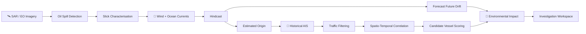

# 🐋 OORCA

### Oceanic Oil Reconnaissance, Correlation & Attribution

> **Satellite-based oil-spill detection, drift reconstruction, AIS correlation, and vessel attribution — in one investigation workspace.**

[](#-sih-problem-statement-26143)
[](LICENSE)
[](https://nodejs.org/)
[](https://react.dev/)

OORCA is a **marine environmental intelligence platform** designed around **SIH Problem Statement 26143 from the National Technical Research Organisation (NTRO)**.

It connects four things that are usually handled separately:

**Satellite imagery → Ocean drift → AIS vessel traffic → Environmental impact**

The goal is straightforward: detect an oil slick, estimate where it came from, reconstruct the vessel traffic around that window, and narrow the investigation down to relevant candidate vessels.

---

## 🚨 Why OORCA?

An oil spill is not just a spot on a satellite image.

The difficult part starts after detection.

You need to understand:

- **Where is the slick?**
- **How large is it?**
- **Where could it have originated?**
- **How did wind and currents move it?**
- **Which vessels were nearby during the relevant time window?**
- **Which vessel trajectories actually overlap with the estimated source?**
- **What marine or coastal resources could be affected?**

OORCA puts those steps into a single workflow.

---

# 🛰️ Core Capabilities

<table>
<tr>
<td width="50%">

### 01 · Spill Detection

Analyse **SAR / EO satellite imagery** to identify and characterise potential oil slicks.

- Slick location
- Spill extent
- Geometry
- Concentration zones
- Estimated spill age where supported

</td>
<td width="50%">

### 02 · Drift Reconstruction

Use environmental conditions to simulate how the spill may have moved.

- Wind
- Ocean currents
- Weather
- Marine conditions
- 72-hour simulation timeline

</td>
</tr>

<tr>
<td width="50%">

### 03 · Hindcasting & Forecasting

Run the model in both directions.

**Hindcast**  
Move backwards to estimate the possible origin and time window.

**Forecast**  
Move forward to estimate possible future movement.

</td>
<td width="50%">

### 04 · AIS Correlation

Reconstruct historical vessel traffic around the estimated origin.

- Vessel proximity
- Track overlap
- Time overlap
- Trajectory
- Movement behaviour
- Candidate-vessel scoring

</td>
</tr>

<tr>
<td width="50%">

### 05 · Vessel Attribution

Filter large volumes of vessel traffic into a smaller set of vessels relevant to the investigation.

> Candidate identification is not proof of responsibility.

</td>
<td width="50%">

### 06 · Environmental Impact

Overlay the simulated spill with environmental information.

- Marine habitats
- Ecological resources
- Coastal areas
- Shoreline arrival
- Environmental risk
- Human-health risk

</td>
</tr>
</table>

---

# 🔬 How OORCA Works



### The investigation loop

```text
Satellite Observation
        ↓
Spill Characterisation
        ↓
Environmental Drift Model
        ↓
Hindcast ──────→ Origin + Time Window
        │
        └────────→ Forecast
                       ↓
                 Historic AIS
                       ↓
              Traffic Filtering
                       ↓
          Spatio-Temporal Correlation
                       ↓
             Candidate Vessels
                       ↓
             Impact Assessment
```

---

# 🚢 Vessel Correlation

OORCA does not treat every vessel near a spill as equally relevant.

After estimating the spill's origin and time window, AIS traffic can be filtered using factors such as:

| Factor | What it tells us |
|---|---|
| **Distance** | How close the vessel was to the estimated source |
| **Time overlap** | Whether the vessel was present during the relevant period |
| **Trajectory** | Whether its movement is consistent with the reconstructed area |
| **Spatial overlap** | Whether its track intersects the candidate source region |
| **Movement pattern** | Whether vessel behaviour requires further inspection |
| **Environmental consistency** | Whether the vessel's position fits the simulated drift history |

The output is a **ranked investigation set of candidate vessels**, not an automatic declaration of liability.

---

# 🌊 Spill Drift Simulation

The current simulation combines environmental drift with oil-spreading and weathering calculations.

A user can configure parameters such as:

- Spill location
- Oil quantity
- Oil type
- Start time
- Vessel information
- Environmental conditions

The simulation can then expose:

- Spill source
- Plume extent
- Spill trajectory
- Affected area
- Time progression
- Weathering estimates
- Estimated shoreline impact

The interface currently supports a **72-hour simulation timeline**.

### One rule stays non-negotiable

> **A simulated trajectory is not an observed trajectory.**

Live, externally sourced, synthetic, and modelled data should remain distinguishable throughout the application.

---

# 🌱 Environmental Impact

A spill investigation should not stop at finding the source.

OORCA can combine the simulated plume with ecological and coastal datasets to examine potential exposure to:

- Marine habitats
- Ecological resources
- Coastal areas
- Shorelines
- Sensitive environmental regions

This creates an additional layer for understanding **where the spill could go and what it could potentially affect**.

---

# 📡 Data Sources

OORCA is designed as a multi-source system.

### 🛰️ Satellite

- **Sentinel-1 SAR**
- Other Earth Observation imagery
- Sentinel-1 SAR Oil Spill Dataset

### 🚢 Vessel / AIS

- Historical AIS tracks
- MarineCadastre sample AIS data
- Real AIS feeds where available
- Synthetic AIS for development and demonstrations

### 🌬️ Environmental

- Ocean currents
- Wind
- Weather
- Sea-state / marine conditions

### 🗺️ Impact

- Coastal locations
- Marine habitats
- Ecological resources
- Shoreline data

---

# 🧠 Production Model Path

The current implementation is designed to demonstrate the complete investigation workflow.

For a more operational system, the modelling and data layers can be extended with:

- [OpenDrift](https://opendrift.github.io/)
- OpenOil
- Copernicus Marine
- NOAA environmental datasets
- Live AIS providers
- Automated Sentinel-1 processing pipelines
- PostGIS-based geospatial analysis

This keeps the application architecture useful beyond a demonstration environment.

---

# 🎯 SIH Problem Statement 26143

OORCA is structured around the requirements of **Smart India Hackathon Problem Statement 26143**, associated with the **National Technical Research Organisation (NTRO)**.

The problem calls for a system capable of:

| SIH Requirement | OORCA |
|---|---|
| Detect oil spills from satellite imagery | ✅ SAR / EO workflow |
| Characterise detected spills | ✅ Slick analysis |
| Estimate spill origin | ✅ Hindcasting |
| Use oceanographic & meteorological data | ✅ Drift simulation |
| Predict future movement | ✅ Forecasting |
| Reconstruct historical AIS traffic | ✅ AIS correlation |
| Remove irrelevant vessel traffic | ✅ Traffic filtering |
| Analyse vessel proximity and trajectory | ✅ Spatio-temporal analysis |
| Identify candidate vessels | ✅ Candidate scoring |
| Present results visually | ✅ Interactive investigation workspace |

### OORCA's core pipeline

```text
SAR / EO
   ↓
Spill Detection
   ↓
Spill Characterisation
   ↓
Hindcasting
   ↓
Origin + Time Estimation
   ↓
Forecasting
   ↓
AIS Reconstruction
   ↓
Traffic Filtering
   ↓
Spatio-Temporal Correlation
   ↓
Vessel Attribution
   ↓
Environmental Impact Assessment
```

---

# 🧰 Technology Stack

The platform is designed around a web-based geospatial workflow.

### Frontend

- React
- TypeScript
- Vite
- Interactive mapping
- WebGL-capable browser

### Backend / Data Layer

- Python-based modelling and processing
- Geospatial analysis
- PostGIS / PostgreSQL where applicable
- REST/API-based external data services

### Geospatial & Scientific Layer

- Sentinel-1 SAR
- OpenDrift / OpenOil integration path
- Oceanographic datasets
- AIS tracks
- Spatial intersection and trajectory analysis

### Development

- Node.js 18+
- npm 9+
- Git / GitHub
- Environment-based API configuration

> Exact services and integrations can vary between development, demo, and production deployments.

---

# ⚡ Getting Started

## Requirements

- Node.js **18+**
- npm **9+**
- Modern browser with WebGL support

## Installation

```bash
git clone <your-repository-url>
cd OORCA
npm install
```

Create your environment file:

```bash
cp .env.example .env
```

On Windows, you can also create `.env` manually from `.env.example`.

Add the API keys and services required by your deployment.

Start the development server:

```bash
npm run dev
```

Open the local URL shown in the terminal.

---

# 🔐 Environment Variables

Keep credentials in `.env`.

Do **not** commit API keys, access tokens, or private service credentials to GitHub.

A typical setup follows this pattern:

```env
VITE_MAP_API_KEY=
VITE_WEATHER_API_KEY=
VITE_AIS_API_KEY=
```

The exact variables depend on the services enabled in your version of OORCA.

Check `.env.example` for the project's current configuration.

---

# 🧪 Demo & Fallback Mode

Real marine datasets are not always available.

APIs fail.  
Satellite processing takes time.  
AIS providers have access restrictions.

OORCA therefore supports a **demo/fallback workflow** using calibrated mathematical models and synthetic or locally available data where appropriate.

The application should clearly distinguish:

```text
LIVE / EXTERNAL DATA
        ≠
SIMULATED / FALLBACK DATA
        ≠
MODELLED RESULTS
```

This is particularly important for an oil-spill investigation system. A convincing visualisation should never be mistaken for an observation.

---

# ⚠️ Limitations

OORCA is an investigation and decision-support platform, not a legal attribution engine.

Results can be affected by:

- Satellite image quality
- SAR acquisition timing
- Weather and ocean-current uncertainty
- AIS coverage and reporting gaps
- Incomplete vessel histories
- Simplified oil-spread assumptions
- Availability of ecological datasets
- Quality of external APIs

A candidate vessel should therefore be treated as a **lead for investigation**, not automatic proof of responsibility.

---

# 🛣️ Roadmap

### Current

- [x] Interactive spill simulation
- [x] 72-hour timeline
- [x] Spill characterisation workflow
- [x] Hindcast / forecast concept
- [x] AIS correlation workflow
- [x] Environmental impact layer
- [x] Demo / fallback mode

### Next

- [ ] Automated Sentinel-1 ingestion
- [ ] ML-based slick segmentation
- [ ] OpenDrift / OpenOil production integration
- [ ] Live AIS ingestion
- [ ] Advanced vessel behaviour analysis
- [ ] PostGIS trajectory analytics
- [ ] Automated evidence/report generation
- [ ] Larger-scale historical AIS processing
- [ ] Operational alerting

---

# 🗂️ Project Structure

A typical deployment is organised around the following layers:

```text
OORCA/
├── frontend/          # Interactive investigation interface
├── backend/           # APIs, processing and simulation
├── data/              # Local/demo datasets
├── models/            # Detection and modelling components
├── scripts/           # Data processing utilities
├── .env.example       # Environment configuration template
├── package.json
└── README.md
```

Your repository may differ depending on the current branch or deployment.

---

# 🤝 Contributing

Contributions are welcome.

If you're working on OORCA, useful areas include:

- Satellite image processing
- SAR oil-spill detection
- Computer vision / ML
- Ocean drift modelling
- AIS data processing
- Geospatial algorithms
- PostGIS
- Environmental datasets
- Frontend visualisation
- Scientific validation

For larger changes, open an issue first so the implementation can be discussed before the code gets too far down the rabbit hole.

---

# 📜 License

OORCA is released under the **Apache License 2.0**.

See [`LICENSE`](LICENSE) for details.

---

# 🔎 Keywords

`oil spill detection` · `oil spill monitoring` · `oil spill tracking` · `Sentinel-1 SAR` · `SAR imagery` · `satellite oil spill detection` · `marine environmental intelligence` · `AIS vessel tracking` · `vessel attribution` · `vessel trajectory analysis` · `oil spill drift simulation` · `oil spill hindcasting` · `oil spill forecasting` · `OpenDrift` · `OpenOil` · `marine pollution monitoring` · `geospatial intelligence` · `remote sensing` · `GIS` · `PostGIS` · `oceanographic modelling` · `Smart India Hackathon` · `SIH 26143` · `NTRO`

---

## 🐋 OORCA

**Observe. Reconstruct. Correlate. Investigate.**

Built for **SIH Problem Statement 26143**.
